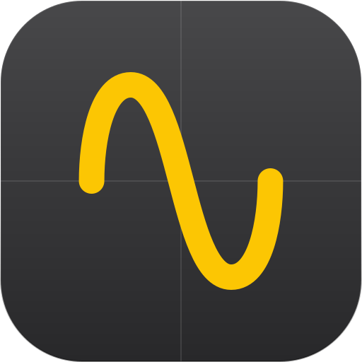
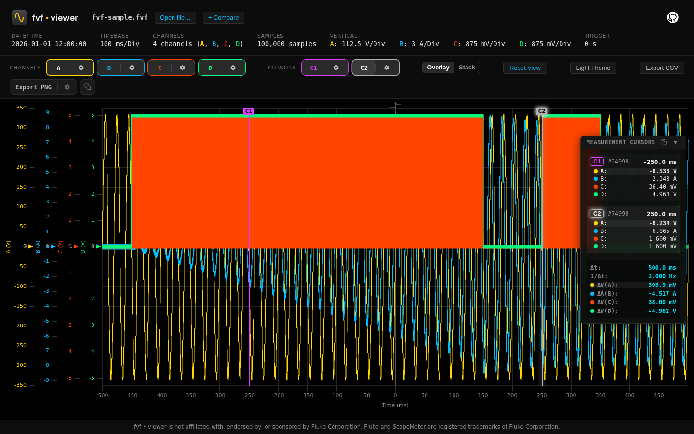

<div align="center">
  <a href="https://github.com/openscope-ai/fvf-viewer"></a>

# fvf • viewer

Browser-based viewer for `.fvf` waveform captures from ScopeMeter instruments.

100% client-side — captures are parsed in your browser and never uploaded.

[](LICENSE)
[](https://github.com/openscope-ai/fvf-viewer/actions/workflows/ci.yml)



</div>

## Usage

**Browser**: [**Start**](https://fvf-viewer.com) the hosted version, then drag
and drop a `.fvf` capture — or click the drop zone to pick one. No capture at
hand? "Test fvf • viewer with a 100k sample synthetic capture" on the
start page loads a synthetic demo.

**Locally**: run the production server from a checkout:

```sh
pnpm install && pnpm build
node apps/server/dist/start.js   # http://localhost:3000
```

## Features

- **Client-side parsing** — a Rust/Wasm engine parses the proprietary binary
  format entirely in your browser (Web Worker, 500–250,000 points per
  channel); nothing is uploaded anywhere.
- **Oscilloscope workspace** — 60 FPS multi-channel canvas (uPlot) with
  box-zoom, per-channel Y axes with canonical SI units, and adaptive
  time-axis units.
- **Measurement cursors** — dual snapping cursors with a live readout card,
  Δt / 1/Δt, per-channel deltas, and out-of-view recovery markers.
- **Exports** — lossless CSV (metadata header + full sample table) and
  high-resolution PNG snapshots.
- **Robust decoding** — localized (EN/DE) headers, comma-decimal timebases,
  non-sequential channel sets, unaligned payload offsets, and typed error
  reporting with detected bytes for corrupt files.
- **Verified** — a full Playwright E2E suite, performance benchmarks, and a
  wasm32 conformance gate run in CI on every change.

## Development

<details>
<summary>Build from source</summary>

| Tool          | Version           | Notes                                                           |
| :------------ | :---------------- | :-------------------------------------------------------------- |
| Node.js       | 22 LTS (`.nvmrc`) |                                                                 |
| pnpm          | 10                | Enabled automatically via Corepack (`corepack enable pnpm`)     |
| Rust          | stable (`rustup`) |                                                                 |
| wasm32 target |                   | `rustup target add wasm32-unknown-unknown`                      |
| wasm-pack     | 0.13+             | [Installation](https://rustwasm.github.io/wasm-pack/installer/) |

| Path              | Package         | Purpose                                                        |
| :---------------- | :-------------- | :------------------------------------------------------------- |
| `apps/web`        | `@fvf/web`      | Vite + React SPA (desktop oscilloscope workspace)              |
| `apps/server`     | `@fvf/server`   | Fastify production server: serves the built SPA, `/api/health` |
| `crates/fvf-wasm` | `@fvf/fvf-wasm` | Rust parsing core compiled to Wasm via wasm-pack               |

```sh
pnpm install        # install workspace dependencies
pnpm build          # wasm -> web + server builds
pnpm dev            # vite dev server (builds wasm first)
pnpm lint           # eslint + prettier
pnpm typecheck      # tsc across the workspace
pnpm test           # vitest (node + browser projects)
pnpm test:e2e       # Playwright E2E against the production server
```

Rust checks: `cargo fmt --all -- --check`, `cargo clippy --workspace
--all-targets -- -D warnings`, `cargo test --workspace`.

</details>

## Trademarks

FVF Viewer is an independent open-source project and is not affiliated with,
endorsed by, or sponsored by Fluke Corporation. Fluke and ScopeMeter are
registered trademarks of Fluke Corporation. FlukeView File (`.fvf`) is a
proprietary format of Fluke Corporation; this project interoperates with it
for analysis purposes.

## License

[MIT](LICENSE) — Copyright (c) 2026 FVF Viewer Contributors
